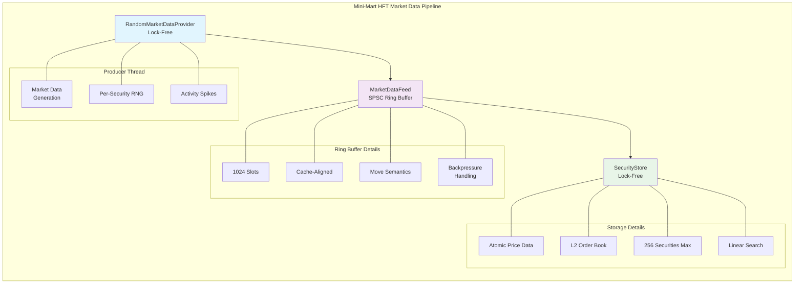
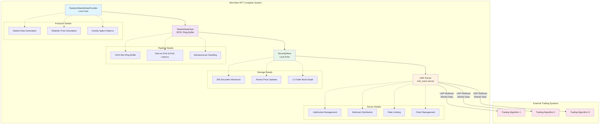

# Mini-Mart HFT Market Data Feed Simulator

Mini-Mart is a high-performance, lock-free market data feed simulator designed for ultra-low latency High-Frequency Trading (HFT) applications. Built with C++20, it implements a complete lock-free architecture using Single Producer Single Consumer (SPSC) ring buffers and atomic operations to achieve deterministic sub-microsecond latency.

## 🏗️ System Architecture

### Current Architecture (Phase 1)



### Target Architecture (Phase 2 - With Server Integration)



## 🔧 Core Components

### 1. Lock-Free Market Data Provider (`RandomMarketDataProvider`)

**Purpose**: Simulates realistic equity market data with proper price movements and L2 order book depth.

**Key Features**:
- **Lock-free subscription management**: Uses atomic compare-and-swap for security slot claiming
- **Realistic price simulation**: Geometric Brownian motion with equity-specific constraints
- **Activity spike simulation**: Configurable burst patterns for stress testing
- **Per-security RNG**: Deterministic and reproducible market data generation

**Thread Safety**: Single producer thread with lock-free subscription/unsubscription

### 2. SPSC Ring Buffer (`SpscRing`)

**Purpose**: Ultra-low latency message passing between producer and consumer threads.

**Key Features**:
- **Lock-free implementation**: Single Producer Single Consumer pattern
- **Cache-aligned**: 64-byte alignment prevents false sharing
- **Power-of-2 sizing**: Optimized for performance (1024 slots default)
- **Move semantics**: Zero-copy message transfer where possible
- **Backpressure handling**: Non-blocking with message dropping under extreme load

**Memory Ordering**: Acquire/release semantics for synchronization, relaxed for performance counters

### 3. Market Data Feed (`MarketDataFeed`)

**Purpose**: Orchestrates the complete market data pipeline with comprehensive monitoring.

**Key Features**:
- **End-to-end latency tracking**: Nanosecond precision timing
- **Statistics collection**: Message throughput, ring utilization, backpressure events
- **Configurable yielding**: Microsecond-level consumer thread control
- **Graceful lifecycle management**: Clean startup/shutdown with proper thread synchronization

**Performance**: Sub-millisecond end-to-end latency, 100+ messages/sec per security

### 4. Lock-Free Security Store (`SecurityStore`)

**Purpose**: High-performance storage and retrieval of real-time market data with atomic updates.

**Key Features**:
- **Fixed-size pre-allocation**: 256 securities maximum for deterministic performance
- **Atomic price updates**: Lock-free best bid/ask and L2 order book updates
- **Cache-friendly design**: 64-byte aligned structures, linear search optimization
- **Snapshot consistency**: Acquire/release semantics ensure consistent reads

**Thread Safety**: Single producer (market data updates), multiple readers (trading algorithms)

### 5. Ultra-Fast Price Type (`Price`)

**Purpose**: Zero-overhead fixed-point arithmetic for USD securities (4 decimal places).

**Key Features**:
- **Fail-fast semantics**: No bounds checking - underflow/overflow indicates logic errors
- **Constexpr operations**: Compile-time arithmetic where possible
- **Type safety**: Prevents mixing Price and Quantity types
- **HFT-optimized**: All operations compile to raw CPU instructions

**Precision**: 4 decimal places (0.0001 USD minimum tick size)

### 6. Server Subsystem (`mini_mart::server`) - *Planned Integration*

**Purpose**: Network distribution of market data to external trading systems.

**Components**:
- **UdpSocket**: Low-level UDP socket management with error handling
- **Server**: High-level market data distribution with rate limiting
- **Multicast support**: Efficient one-to-many market data distribution

## 📊 Performance Characteristics

### Latency Metrics
- **End-to-end latency**: < 1ms (producer to consumer)
- **Price update latency**: Sub-microsecond atomic operations
- **Ring buffer operations**: Lock-free, deterministic timing
- **Memory allocation**: Zero dynamic allocation in hot paths

### Throughput Metrics
- **Message processing**: 100+ messages/sec per security
- **Concurrent securities**: Up to 256 securities simultaneously
- **Ring buffer capacity**: 1024 message slots with backpressure handling
- **Test validation**: 67 comprehensive tests including stress testing

### Memory Layout
- **Cache alignment**: 64-byte alignment for all hot data structures
- **False sharing prevention**: Careful memory layout design
- **Pre-allocation**: Fixed-size arrays eliminate allocation overhead
- **Memory ordering**: Optimized acquire/release vs relaxed semantics

## 🚀 Building and Running

### Prerequisites
- **C++20 compatible compiler** (GCC 10+ or Clang 12+)
- **Google Test** for unit testing
- **Linux** (tested on Ubuntu 20.04+)

### Build Commands

```bash
# Development build with debugging
make build

# Production build (optimized)
make build-prod

# Run comprehensive test suite
make test

# Run with various sanitizers
make asan-test      # AddressSanitizer (recommended)
make tsan-test      # ThreadSanitizer 
make ubsan-test     # UndefinedBehaviorSanitizer

# Performance profiling
make callgrind      # Valgrind callgrind profiler
```

### Running the Simulator

```bash
# Basic execution
make run

# The simulator will:
# 1. Start market data generation for major US equities
# 2. Display real-time statistics (messages/sec, latency, ring utilization)
# 3. Run until Ctrl+C (graceful shutdown)
```

## 🧪 Testing Strategy

### Test Coverage (67 Tests)
- **Unit tests**: Individual component validation
- **Integration tests**: End-to-end pipeline testing
- **Concurrency tests**: Multi-threaded stress testing
- **Performance tests**: Latency and throughput validation
- **Edge case tests**: Boundary conditions and error scenarios

### Sanitizer Validation
- **AddressSanitizer**: Memory safety validation
- **ThreadSanitizer**: Race condition detection
- **UndefinedBehaviorSanitizer**: Validates unsafe Price operations

## 📈 Configuration

### Market Data Provider Configuration
```cpp
RandomMarketDataProvider::Config config;
config.update_interval_us = 50;        // 50μs update interval
config.messages_per_burst = 3;         // Messages per security
config.volatility = 0.005;             // Price volatility factor
config.enable_activity_spikes = true;  // Stress testing mode
config.spike_probability = 10;         // 10% spike probability
config.spike_multiplier = 15;          // 15x burst during spikes
```

### Market Data Feed Configuration
```cpp
MarketDataFeed::Config config;
config.consumer_yield_us = 1;          // Consumer thread yield time
config.enable_statistics = true;       // Performance monitoring
```

## 🔮 Roadmap

### Phase 1: Core Pipeline ✅
- [x] Lock-free market data provider
- [x] SPSC ring buffer implementation  
- [x] Market data feed orchestration
- [x] Lock-free security store
- [x] Ultra-fast Price type
- [x] Comprehensive test coverage

### Phase 2: Server Integration 🚧
- [ ] Integrate UDP server with market data pipeline
- [ ] Implement multicast market data distribution
- [ ] Add rate limiting and client management
- [ ] Network protocol definition and documentation
- [ ] End-to-end network latency testing

### Phase 3: Production Readiness 📋
- [ ] Configuration management system
- [ ] Structured logging and monitoring
- [ ] Circuit breaker patterns for resilience
- [ ] Performance benchmarking suite
- [ ] Deployment automation and documentation

## 🏛️ Architecture Principles

### Lock-Free Design
- **No mutexes**: Eliminates unpredictable blocking and priority inversion
- **Atomic operations**: Compare-and-swap for slot management
- **Memory ordering**: Careful acquire/release vs relaxed semantics
- **ABA safety**: Proper memory ordering prevents race conditions

### Cache Optimization
- **64-byte alignment**: Prevents false sharing between CPU cores
- **Linear data access**: Cache-friendly memory access patterns
- **Pre-allocation**: Eliminates dynamic allocation overhead
- **Hot/cold separation**: Frequently accessed data grouped together

### Fail-Fast Philosophy
- **Price underflow**: Indicates logic errors immediately
- **Capacity limits**: Fixed-size structures with clear boundaries
- **Error propagation**: Explicit error handling without exceptions
- **Deterministic behavior**: Predictable performance characteristics

---

**Built for HFT. Optimized for humans. Designed to scale.**